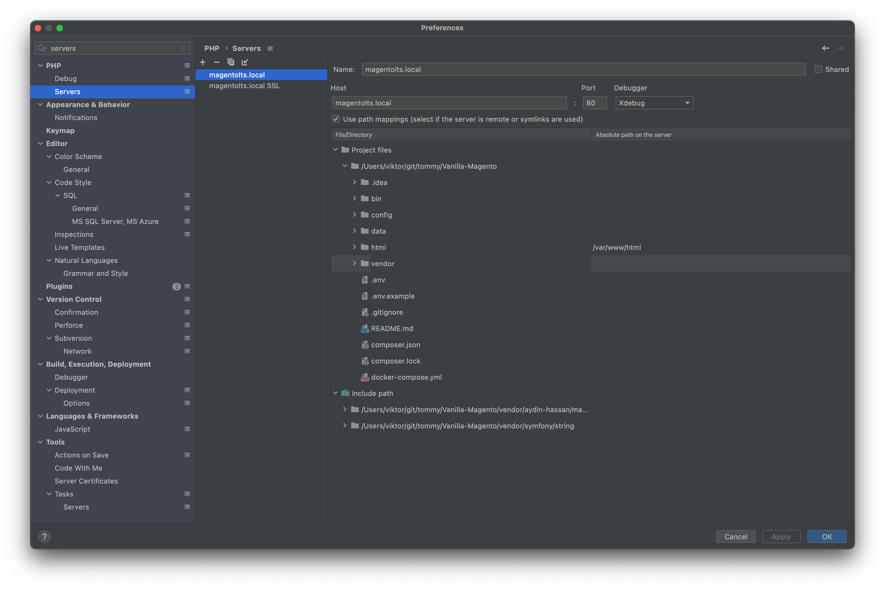
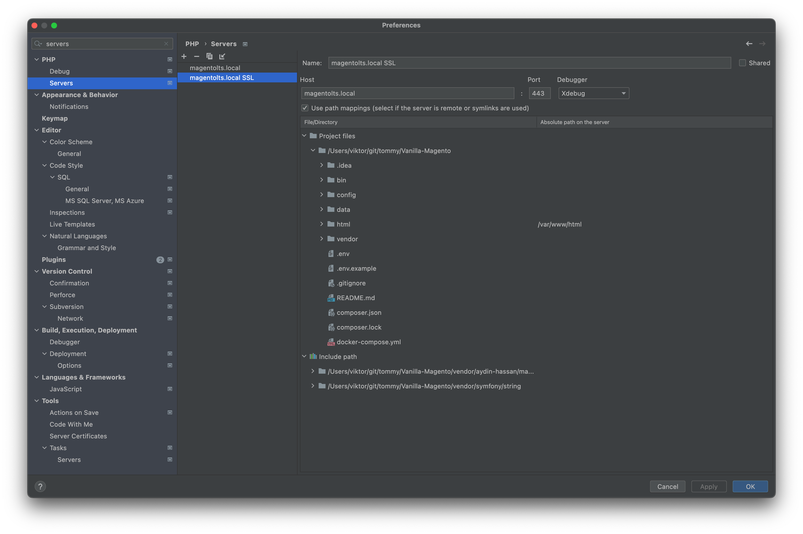
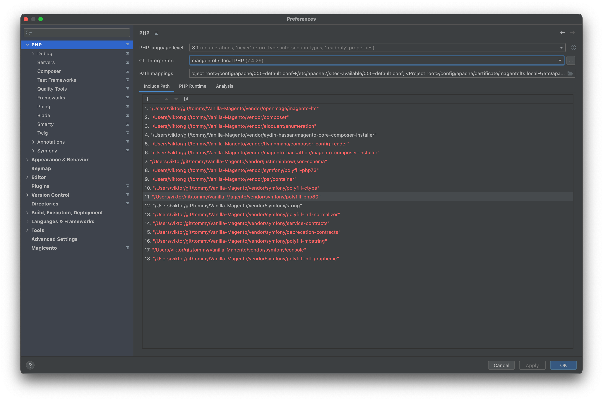
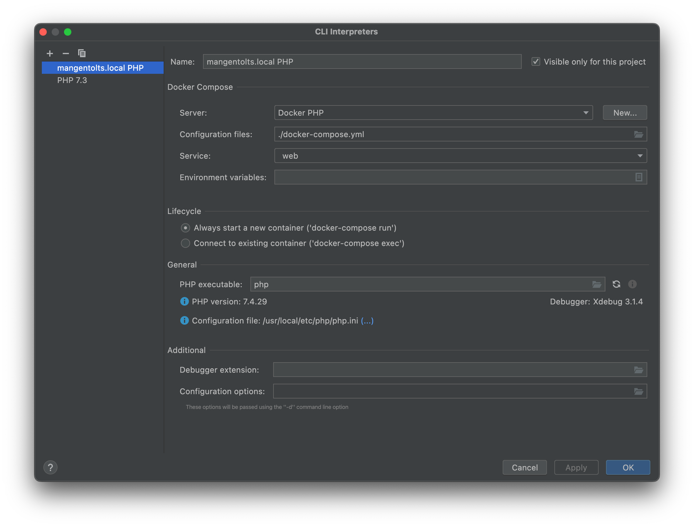

# How to debug

Used technology: [XDebug](https://xdebug.org/)

## Intial project IDE setup

Setup servers:

Setup PHP preferences:

Setup CLI interpreter:

Install and setup Browser Xdebug extension [link](https://www.jetbrains.com/help/phpstorm/browser-debugging-extensions.html),

Deactivate in PHPStorm setting from debug->Break at first line in PHP Scripts.

In PHPSTORM activate Listen for Debug(Up Call btn to be green).

## That's all :-)
